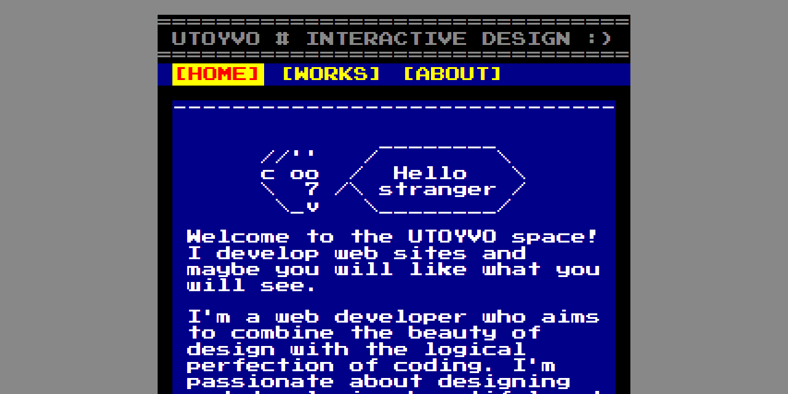

# UTOYVO # INTERACTIVE DESIGN

Welcome to the UTOYVO space! I develop web sites and maybe you will like what you will see here.



## STRUCTURE
```
├── public
|   ├── assets
|   │   ├── css
|   |   |   └── style.css
|   │   ├── img
|   |   |   └── icons
|   |   |       ├── icon-16x16.png
|   |   |       ├── icon-32x32.png
|   |   |       ├── icon-60x60.png
|   |   |       ├── icon-76x76.png
|   |   |       ├── icon-96x96.png
|   |   |       ├── icon-120x120.png
|   |   |       ├── icon-144x144.png
|   |   |       ├── icon-152x152.png
|   |   |       ├── icon-180x180.png
|   |   |       └── icon-192x192.png
|   │   ├── js
|   |   |   └── app.js
|   │   └── libs
|   |       └── jquery-3.5.1.min.js
|   └── uploads
|       └── .empty
├── CNAME
├── favicon.png
├── index.html
├── LICENSE
├── README.md
└── screenshot.png
```

## BUILT WITH
- [jQuery 3.5.1](https://github.com/jquery/jquery/releases/tag/3.5.1)

## CONTRIBUTOR
Oleksandr Klochko [@utoyvo](https://github.com/utoyvo)

## LICENSE
Code released under the [MIT License](LICENSE).
